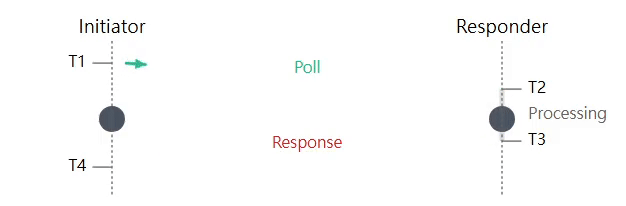
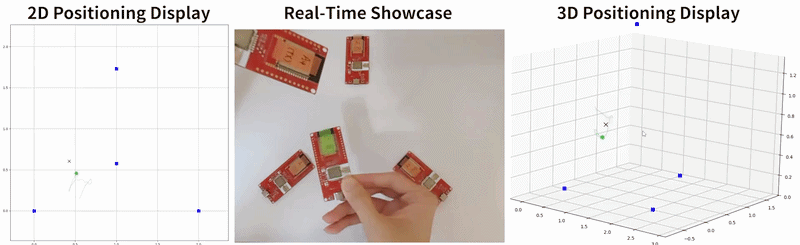
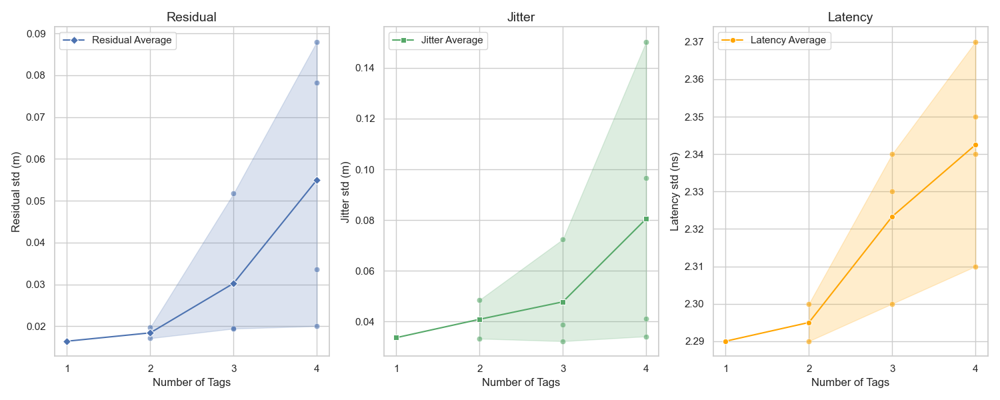
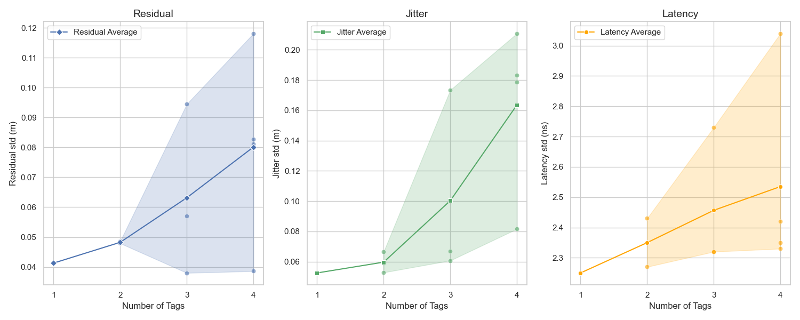
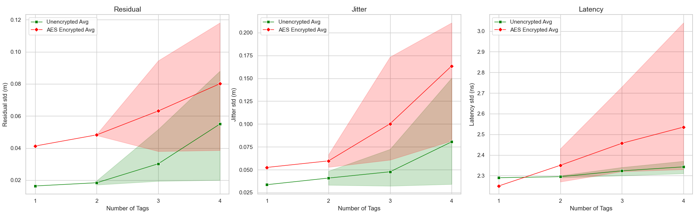
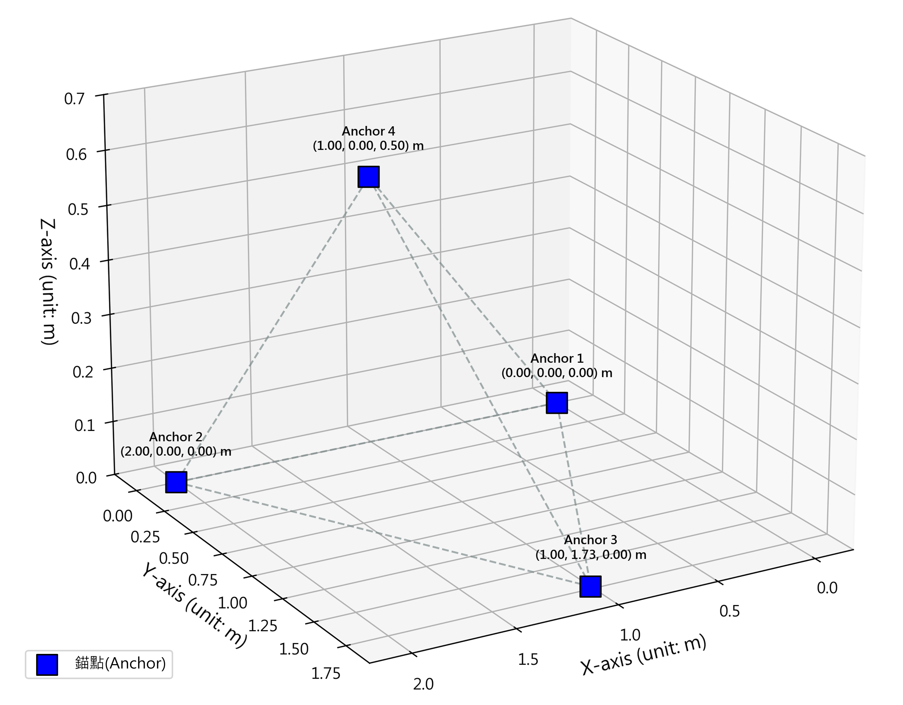
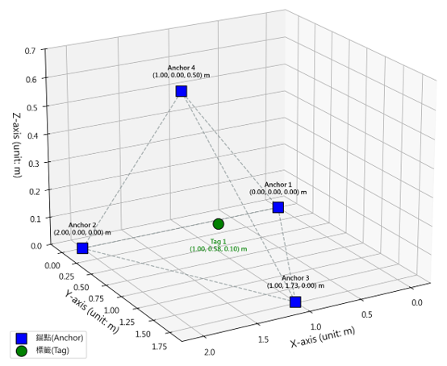

# DW3000 超広帯域空間測位セキュア伝送システム

[](LICENSE) 


---
`以下のボタンをクリックして言語を切り替えてください！！`

[](README.md) 
[](README.zh-TW.md)
[](README.ja.md)

---

## 📌 本システムについて
本プロジェクトは `DW3000 UWB モジュール` を `Arduino`、`Python`、`SS-TWR` と組み合わせてリアルタイム空間測位を実現します。さらに `AES-CCM 暗号化アルゴリズム` と `セキュアタイムスタンプ STS` を備え、測位データの無線伝送における機密性と完全性を確保し、安全な IoT 空間伝送システムを構築します。

* **システムデモ**

| 対称双方向測距 SS-TWR | リアルタイム空間測位 |
| :---: | :---: |
|  <br> 双方向パケットによりボード間の距離を算出 |  <br> 2D/3D アルゴリズムで Tag の位置を特定 |

* **パケットフォーマット（暗号化なし）**

`Poll パケット`
| フィールド | Mac Header | Seq Num | Pan ID | Tag ShortAdr | Anc ShortAdr | Function | CRC |
| :--- | :---: | :---: | :---: | :---: | :---: | :---: | :---: |
| **長さ** | 2B | 1B | 2B | 2B | 2B | 1B | 2B |
| **値** | `41 88` | `A5` | `CA DE` | `54 31` | `41 31` | `E0` | `FA E4` |
| **説明** | MAC ヘッダ | シーケンス番号 | ネットワーク ID | タグ短アドレス | アンカー短アドレス | 機能コード (Poll) | 誤りチェック |

`Response パケット`
| フィールド | Mac Header | Seq Num | Pan ID | Tag ShortAdr | Anc ShortAdr | Function | T2 poll_rx | T3 resp_tx | CRC |
| :--- | :---: | :---: | :---: | :---: | :---: | :---: | :---: | :---: | :---: |
| **長さ** | 2B | 1B | 2B | 2B | 2B | 1B | 4B | 4B | 2B |
| **値** | `41 88` | `00` | `CA DE` | `41 31` | `54 31` | `E1` | `59 1A 57 05` | `01 5A 26 09` | `85 2D` |
| **説明** | MAC ヘッダ | シーケンス番号 | ネットワーク ID | タグ短アドレス | アンカー短アドレス | 機能コード (Response) | 受信タイムスタンプ ($T_2$) | 送信タイムスタンプ ($T_3$) | 誤りチェック |

* **パケットフォーマット（AES-CCM 暗号化）**

`Poll パケット`
| フィールド | FCF | Seq Num | Pan ID | Dst_Adr | Src_Adr | Security Control | Frame Counter | Key Index | Payload | MIC | CRC |
| :--- | :---: | :---: | :---: | :---: | :---: | :---: | :---: | :---: | :---: | :---: | :---: |
| **長さ** | 2B | 1B | 2B | 8B | 8B | 1B | 4B | 1B | 12B | 16B | 2B |
| **値** | `09 EC` | `D0` | `21 43` | `88 77...11` | `11 22...88` | `0F` | `D0 09 00 00` | `01` | `5D 9B...F5` | `EF 60...CE` | `9D 8E` |
| **説明** | フレーム制御 | シーケンス番号 | ネットワーク ID | 宛先長アドレス | 送信元長アドレス | 暗号化制御バイト | リプレイ防止カウンタ | 鍵インデックス | AES 暗号化データ | メッセージ認証コード | 誤りチェック |

---

## 🌳 ディレクトリ構成
```bash
📂 UWB_Program_DW3000
┣ 📂 PriUint64        # uint64 表示用ライブラリ (デバッグ用)
┣ 📂 DW3000           # UWB ハードウェアドライバライブラリ
┃  ┣ 📝 dw3000.h                     # メインインクルードヘッダ
┃  ┣ 📝 dw3000_types.h               # データ型定義
┃  ┣ 📝 dw3000_version.h             # ドライババージョン
┃  ┣ 📝 dw3000_regs.h                # レジスタアドレス
┃  ┣ 📝 dw3000_vals.h                # 定数とバッファオフセット
┃  ┣ 📝 dw3000_shared_defines.h      # PHY 層定数
┃  ┣ 📝 dw3000_mutex.cpp             # ミューテックスロック
┃  ┣ 📝 dw3000_port.h                # Arduino SPI ピン設定
┃  ┃ 
┃  ┣ 📝 dw3000_config_options.h      # PHY 設定インデックステーブル
┃  ┣ 📝 dw3000_config_options.cpp    # 設定構造体インスタンス
┃  ┃ 
┃  ┣ 📝 dw3000_device_api.h          # レジスタ読み書き/変更マクロ
┃  ┣ 📝 dw3000_device_api.cpp        # チップレベル API
┃  ┃     
┃  ┣ 📝 dw3000_mac_802_15_4.h        # MAC フレームとセキュリティヘッダ定義
┃  ┣ 📝 dw3000_mac_802_15_4.cpp      # MAC とセキュリティ層処理
┃  ┃ 
┃  ┣ 📝 dw3000_shared_functions.h    # 検証ユーティリティ宣言
┃  ┣ 📝 dw3000_shared_functions.cpp  # パケットポインタユーティリティ
┃  ┃ 
┃  ┣ 📝 dw3000_uart.h                # UART ボーレート設定
┃  ┗ 📝 dw3000_uart.cpp              # シリアルポート通信
┃
┣ 📂 Draw_Error_Images  # 統計グラフ出力
┣ 📂 dump_file          # 雑多なスクリプト
┣ 
┣ 📂 Anchor_Encryption
┃  ┗ 📟 Anchor_Encryption.ino  # Anchor ファームウェア (受信)
┣ 📂 Tag_Encryption
┃  ┗ 📟 Tag_Encryption.ino     # Tag ファームウェア (送信)
┣ 
┣ 🐍 2D_3D_position_display_res_jitter_ns.py  # 2D/3D 測位表示 + 残差/ジッタ/遅延グラフ
┣ 🐍 2D_position_display.py                   # 2D 測位表示
┣ 🐍 Draw_dis_ns.py                           # 距離/遅延グラフ
┃
┣ 🐍 Draw_res_jitter_ns.py  # 複数 Tag 残差/ジッタ/遅延比較
┣ 🐍 Positioning.py         # フィールド配置図
┃
┣ 🐍 Draw_packet.py         # パケットフォーマット可視化ツール
┣ 🐍 UDP_to_Wireshark.py    # パケットスニッフィング
┃
┣ 📝 README.md         # 英語ドキュメント
┣ 📝 README.zh-TW.md   # 繁体字中国語ドキュメント
┣ 📝 README.ja.md      # 日本語ドキュメント
┗ 📋 requirements.txt  # 必要な Python パッケージ一覧
```

---

## ⚙️ 事前インストール設定

### 1. ハードウェア

USB ドライバをインストールしてください：https://www.silabs.com/software-and-tools/usb-to-uart-bridge-vcp-drivers?tab=downloads

> お使いの OS に応じて適切なドライバを選択してください：
> - (Windows) `CP210x Universal Windows Driver`
> - (Mac) `CP210x VCP Mac OSX Driver`
>
> インストール後、Arduino IDE がボードを正しく認識します。

---

### 2. Arduino 設定

`DW3000` フォルダと `PriUint64` フォルダを `libraries` フォルダにコピーします：
```bash
 .\Arduino\libraries 
```

Arduino IDE のボード設定：
```bash
 ツール -> ボードメニュー 
```
| 設定項目 | 設定値 |
| :--- | :--- |
| `Board` | ESP32 Dev Module |
| `Port` | USB ポートに依存 |
| `CPU Frequency` | 240MHz (WiFi/BT) |
| `Core Debug Level` | None |
| `Erase All Flash Before Sketch Upload` | Disabled |
| `Events Run On` | Core 1 |
| `Flash Frequency` | 80MHz |
| `Flash Mode` | QIO |
| `Flash Size` | 4MB (32Mb) |
| `JTAG Adapter` | Disabled |
| `Arduino Runs On` | Core 1 |
| `Partition Scheme` | Default 4MB with spiffs (1.2MB APP/1.5MB SPIFFS) |
| `PSRAM` | Disabled |
| `Upload Speed` | 921600 |

> コンパイル中に次のエラーが発生した場合：
> ```cpp
> sketch_name.ino:X:XX: fatal error: XXX.h: No such file or directory
> #include <XXX.h>
>          ^~~~~~~
> compilation terminated.
> exit status 1
> Compilation error: XXX.h: No such file or directory
> ```
> Arduino ライブラリマネージャから該当ライブラリをインストールするか、手動で `libraries` フォルダに配置してください。

---

### 3. Python 設定

VSCode のターミナルで、必要な Python パッケージをインストールします：
```bash
pip install -r requirements.txt
```
| パッケージ名 | バージョン | 用途 |
| :--- | :--- | :--- |
| `numpy` | `2.2.6` | 高速配列・行列演算 |
| `pandas` | `2.3.1` | データ分析と整形 |
| `matplotlib` | `3.10.5` | 基本グラフ描画 |
| `seaborn` | `0.13.2` | 高品質な統計グラフ描画 |
| `pyserial` | `3.5` | PC と ESP32 の USB シリアル通信 |

> 次のエラーが発生した場合：
> ```py
> Traceback (most recent call last):
>   File "XX.py", line X, in <module>
>     import XXX
> ModuleNotFoundError: No module named 'XXX'
> ```
> ターミナルで `pip install <パッケージ名>` を実行するか、インターネットでインストール方法を検索してください。

---

## 📁 ファームウェア

### Tag_Encryption.ino

> **役割**：Poll パケットを能動的に送信し、Anchor からの応答を受信し、飛行時間 (ToF) と距離を計算し、シリアルまたは WiFi UDP で結果をブロードキャストします。

#### 環境設定

```cpp
// システム内の Tag の総数（1 ~ 4）
int totalTags = 4;

// フィールドに配置された Anchor の総数（1 ~ 4）
#define NUM_ANCHORS 4
```

| パラメータ | 説明 |
| :--- | :--- |
| `totalTags` | 時分割多重のための Tag 総数。各 Tag にタイムスロットを割り当てます |
| `NUM_ANCHORS` | Tag が順次測距する Anchor の数を設定。`ANCHOR_LIST` 配列の展開数に影響します |

#### 暗号化設定

```cpp
// Tag 識別子（T1 ~ T4）
const uint8_t TAG_ADDR[] = { 'T', '1' };

// STS 暗号化を有効化
#define STS_ENCRYPTION   false  // false | true

// AES-CCM 暗号化を有効化
#define AES_ENCRYPTION   false  // false | true

// パディングバイト（0 ~ 47）
#define Padding  0

// ランダム Nonce バイト数（0 ~ 4）
#define Random_Nonce_Byte  0
```

| パラメータ | デフォルト | 説明 |
| :--- | :---: | :--- |
| `TAG_ADDR` | `'T','1'` | 2 文字の識別子。ネットワーク短アドレスとしても使用。T1, T2, ... と順に命名推奨 |
| `STS_ENCRYPTION` | `false` | DW3000 ハードウェア STS を有効化し PHR を暗号化/復号化。物理層の改ざんを防止 |
| `AES_ENCRYPTION` | `false` | MAC ペイロードを AES-CCM で暗号化しデータの機密性を確保 |
| `Padding` | `0` | パケット末尾に無意味なバイトを追加。ストレステストや異なるパケットサイズのシミュレーション用 |
| `Random_Nonce_Byte` | `0` | Nonce (IV) のランダムバイト数。値が大きいほど衝突確率は低下するが検索時間は増加 |

> **推奨暗号化組み合わせ**：
> - `STS=false, AES=false`：純粋測距モード、最低遅延
> - `STS=true, AES=false`：物理層のみ保護。測距精度が重要な場合に適用
> - `STS=false, AES=true`：MAC ペイロードのみ暗号化。測距結果の保護が必要な場合に適用
> - `STS=true, AES=true`：二重保護（現在テスト段階、本番運用非推奨）

#### ネットワーク設定

```cpp
// WiFi 接続情報
#define tmp_ssid      "SSID"
#define tmp_password  "PASSWORD"
```

#### 複数 Tag 設定

```cpp
// Tag ごとのタイムスロット長（ms）
unsigned long slotDuration = 30;

// 時分割モードを有効化（totalTags > 1 の場合は true 必須）
#define window_mode true
```

| パラメータ | 説明 |
| :--- | :--- |
| `slotDuration` | 各 Tag 専用の送信ウィンドウ (ms)。ウィンドウ内で Tag は全 Anchor と順次測距 |
| `window_mode` | `true` = 時分割多重。複数 Tag の同時送信による衝突を防止<br>`false` = 連続測距 (単一 Tag 専用) |

> システム時間は `totalTags × slotDuration` の周期に分割されます。各 Tag は自身の `(myTagID-1) × slotDuration ∼ myTagID × slotDuration` ウィンドウ内でのみ送信し、それ以外はアイドル状態を維持します。

---

### Anchor_Encryption.ino

> **役割**：Poll パケットを受動的に待機し、到着タイムスタンプを記録し、双方のタイムスタンプを含む Response を返送します。Anchor は距離を計算せず、Tag の双方向測距を支援するのみです。

#### 暗号化とセキュリティ設定

```cpp
// Anchor 識別子（A1 ~ A4）
const uint8_t ANCHOR_ADDR[] = { 'A', '1' };

// STS 暗号化（Tag 側と一致させる必要あり）
#define STS_ENCRYPTION  false  // false | true

// AES 暗号化（Tag 側と一致させる必要あり）
#define AES_ENCRYPTION  false  // false | true

// パディングバイト（Tag 側と一致させる必要あり）
#define Padding  0
```

| パラメータ | デフォルト | 説明 |
| :--- | :---: | :--- |
| `ANCHOR_ADDR` | `'A','1'` | 2 文字の識別子。A1, A2, ... と順に命名推奨 |
| `STS_ENCRYPTION` | `false` | 全 Tag と同一設定が必要。一致しない場合 STS 鍵検証に失敗しパケットが破棄される |
| `AES_ENCRYPTION` | `false` | 全 Tag と同一設定が必要。一致しない場合復号に失敗 |
| `Padding` | `0` | Tag 側の `Padding` 値と一致必須。不一致の場合パケット長の不整合により解析エラー |

---

## 🐍 Python 測位プログラム

### 2D_position_display.py

> `UDP プロトコル` を介して Tag の `JSON 測距データ` を受信し、2D 平面上に Tag 位置をリアルタイム表示します。3 Anchor 三角測量に対応。

#### ネットワーク設定
```python
# UDP 受信 IP をバインド（Tag WiFi と同じサブネットである必要あり）
sock.bind(('192.168.0.108', 8001))

# Anchor 間の物理距離（メートル）
self.distance_A1_A2 = 2.0
```

**`機能`**
- **複数 Anchor の可視化**：青色線で Anchor を接続し測位フィールドを形成
- **距離円表示**：各 Anchor を中心に測距半径の円を描画（表示切替可能）
- **EKF カルマンフィルタ**：拡張カルマンフィルタを内蔵し軌跡を平滑化、ノイズを低減
- **生データ vs フィルタ後**：生の測定点と EKF 予測点を同時表示
- **履歴軌跡**：最近 40 件の位置軌跡を表示
- **速度推定**：EKF 状態ベクトルからリアルタイム移動速度を自動推定

**`ボタン機能`**
| ボタン | 機能 |
| :--- | :--- |
| `Raw` | 生測定点の表示を切り替え |
| `Circles` | Anchor 距離円の表示を切り替え |
| `EKF` | カルマンフィルタ予測点と軌跡の表示を切り替え |

---

### 2D_3D_position_display_res_jitter_ns.py

> `2D 俯瞰図` と `3D 立体図` を同時に表示し、`残差 Residual` `ジッタ Jitter` `遅延 Latency` の 3 大性能指標の統計グラフを自動エクスポートします。

#### 設定
```python
CONFIG = {
    "ENABLE_STATS_EXPORT": True,   # 統計エクスポート機能を有効化
    "SHOW_CLOUD_POINTS": True,     # 初期状態：履歴パスクラウドを表示
    "SHOW_RAW_POINTS": True,       # 初期状態：生測定点を表示
    "SHOW_PREDICT_POINTS": False,  # 初期状態：EKF 予測点と軌跡を表示
    "TARGET_SAMPLES": 1000,        # このサンプル数に達したら自動保存
}
```

#### Anchor 座標設定
```python
self.anchors = {
    'A1': (0.0, 0.0, 0.0),       # 原点
    'A2': (2.0, 0.0, 0.0),       # X 軸
    'A3': (1.0, 1.732, 0.0),     # 正三角形の頂点
    'A4': (1.0, 0.0, 0.4),       # Z 軸（3D 測位用）
}
```

**`機能`**
- **デュアルビュー同期表示**：左側 2D 俯瞰図 + 右側 3D 立体図
- **複数 Tag 同時追跡**：T1 ~ T4 の最大 4 つの Tag を色分けして同時表示
- **3D 4 Anchor 測位**：最小二乗法 (LSTSQ) で 3D 座標を算出（4 つ以上の Anchor が必要）
- **履歴パスクラウド**：全履歴の生データ点を累積表示
- **性能指標エクスポート**：`TARGET_SAMPLES` に達すると `Residual` `Jitter` `Latency` の統計グラフを自動保存

**`ボタン機能`**
| ボタン | 機能 |
| :--- | :--- |
| `Rotate` | 3D ビューの自動回転のオン/オフ |
| `Cloud` | 履歴パスクラウドの表示切替 |
| `Raw` | 生測定点の表示切替 |
| `EKF` | EKF 予測点と軌跡の表示切替 |

**`エクスポートされるグラフ`**
| グラフ | X 軸 | Y 軸 | 意味 |
| :--- | :--- | :--- | :--- |
| Residual グラフ | サンプル番号 | 測位残差 (m) | 生データ点と各 Anchor 距離円の一致度。小さいほど高精度 |
| Jitter グラフ | サンプル番号 | 隣接変位 (m) | 前後する生データ点間の変位量。小さいほど軌跡が滑らか |
| Latency グラフ | サンプル番号 | 伝送遅延 (ns) | 測距1往復あたりの所要時間。システムのリアルタイム性を反映 |

---

### Draw_dis_ns.py 

> シリアルポートから測距データをリアルタイムに読み取り、`距離 Distance` と `遅延 Latency` のグラフを描画します。

#### 設定
```python
PORT = 'COM10'             # シリアルポート番号（USB 接続に依存）
BAUD_RATE = 115200         # ボーレート
DATA_LIMIT = 5000          # 1回のキャプチャあたりの最大サンプル数
padding = '0'              # 現在のテスト Padding 値（ファイル名と統計分類に使用）
encryption = 'AES_'        # 暗号化モード接頭辞（non- / STS_ / AES_ / AES+STS_）
```

**`機能`**
- 2 つのグラフを並べて表示：左 = 距離 (m)、右 = 遅延 (ns)
- 平均値（赤い破線）と標準偏差を自動計算して表示
- 複数回のテスト結果を蓄積する JSON 自動エクスポートに対応

> プログラムを実行してシリアルポートからデータを読み取ります。`DATA_LIMIT` サンプルに達するとグラフが自動的に `Draw_Error_Images/` フォルダに保存されます。

---

### Draw_res_jitter_ns.py

> 複数の Tag の `Residual` `Jitter` `Latency` データを手動入力し、暗号化モード別の比較グラフを生成します。

#### データ入力設定
```python
data = {
    'Tags':     [1, 2, 2, 3, 3, 3, 4, 4, 4, 4],
    'Residual': [0.0164, 0.0171, 0.0197, 0.0196, 0.0194, 0.0517, 0.0336, 0.0200, 0.0783, 0.0880],
    'Jitter':   [0.0336, 0.0485, 0.0332, 0.0386, 0.0322, 0.0724, 0.0410, 0.0341, 0.1503, 0.0966],
    'Latency':  [2.29, 2.30, 2.29, 2.30, 2.33, 2.34, 2.34, 2.35, 2.37, 2.31]
}
```

#### 表示モード設定
```python
section = 0  # 0 = 単一グラフモード, 1 = 比較グラフモード
choose  = 0  # 0 = 非暗号化データ, 1 = 暗号化データ
```

| `section` | `choose` | 出力結果 |
| :---: | :---: | :---: |
| `0` | `0` |  |
| `0` | `1` |  |
| `1` | `任意` |  |

---

### Positioning.py

> Anchor と Tag の座標に基づいて `3D フィールド配置図` を描画します。

#### Anchor 座標設定
```python
anchors = {
    'Anchor 1': [0.00, 0.00, 0.00],    # (x, y, z) メートル
    'Anchor 2': [2.00, 0.00, 0.00],
    'Anchor 3': [1.00, 1.73, 0.00],
    'Anchor 4': [1.00, 0.00, 0.50]
}
```

#### Tag 表示設定
```python
Add_Tag = True   # False | True
```

| `Add_Tag` | 出力結果 |
| :---: | :---: |
| `False` |  |
| `True` |  |

---

## 🐍 Python パケットツール

### Draw_packet.py

> Hex 形式の UWB パケットを入力すると、その構造を自動解析し `パケットフォーマット図` を描画します。DW1000 と DW3000 両方のプロトコルフォーマットに対応。

**対応パケットタイプ（DW3000）**：
| パケットタイプ | 識別条件 | 説明 |
| :--- | :--- | :--- |
| `Poll` | 10 バイト目 = 0xE0 | Tag が送信する測距要求 |
| `Response` | 10 バイト目 = 0xE1 | Anchor が返信する測距応答（タイムスタンプ含む） |
| `Poll AES` | FCF = 0x09, 0xEC | AES 暗号化を有効にした Poll パケット（セキュリティヘッダを含む） |

**使用方法**：
```bash
python Draw_packet.py
# ターミナルに Hex パケット文字列を貼り付けてください
```

---

### UDP_to_Wireshark.py

> UDP ブロードキャストパケットを受信し、測距データを標準フォーマットに変換して出力します。Wireshark と組み合わせてパケット解析を行う必要があります。

---

## License

Apache License 2.0. See `LICENSE`.
